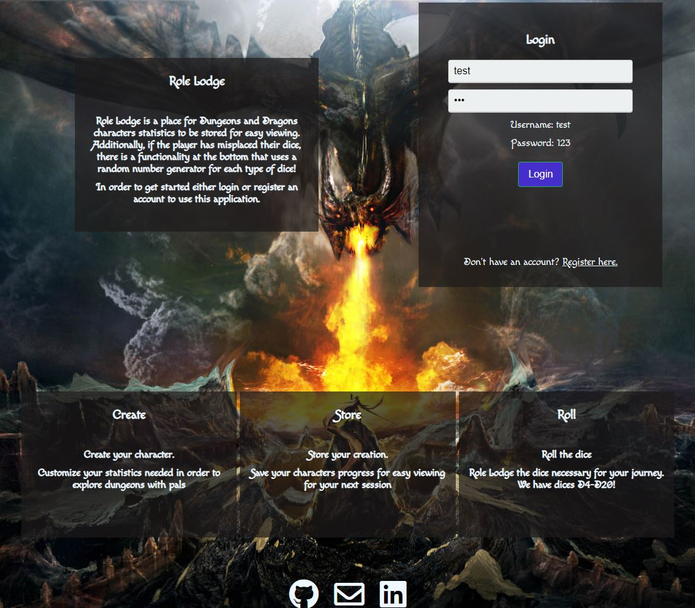

# Role Lodge (Dungeons and Dragons Character Sheet)
Live Preview with react @ https://dnd-character-sheet-react.herokuapp.com/

Live Preview with Node https://dnd-character-sheet-node.herokuapp.com/

Description Here

## Screenshots

Landing Page/Login Page 

## User Stories
**Landing Page**

  As a user, I want to view the first page of the app and how to use it.

  As a user, I will also see a login form where I can input a prexisting account name and password.

  As a user, I will also be able to click on a button that takes me to the registration form.

  As a user, I will also be able to click the login button after inputting my account information taking me to the main form.

  **Registration Page**

  As a user, I will be able to see the required fields for registration.

  As a user, I will also be able to click on a button that takes me to the login form.

  As a user, I will also be able to click the regstier button after inputting my account information taking me to the main form.

  **Character Page**

  As a user, I will be able to see the left hand table which holds prexisting character names. (if existing).

  As a user, I will be able to click/select a character name, doing so I will see the every field populated based on the previous entries for that character.

  As a user, I will also be able to see the characters name I selected, if no character is selected the fields will be empty and the name will say 'Create New Chracter'.

  As a user, I will also see a delete button on the bottom right when a character name is selected and the form is populated.

  As a user, if I save the character information, I will see a 'saved' notification, and the character name and will be added to the left-hand table and fields will be saved for that character.

  As a user, if I delete the character currently selected, I will see all fields populate back to nothing, and the character name will be removed from the left-hand table.

## Technical

<h3>Technolgies used</h3>

#### Front End

* HTML5
* CSS3
* JavaScript
* jQuery
* React

#### Back End

* Node.js
* Express.js
* MongoDB
* Mongoose
* mLab database
* Mocha and Chai for testing
<h3>Responsive</h3>
<ul>
  <li>The app is responsive and optimized for both desktop and mobile viewing and use.</li>
</ul>

## Development Road Map

## Node command lines
* npm install ==> install all node modules
    * npm install --save bcryptjs body-parser cors express mongodb mongoose passport passport-http unirest
    * npm install --save-dev chai chai-http mocha faker
* nodemon server.js ==> run node server
* npm test ==> run the tests
